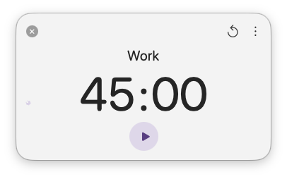
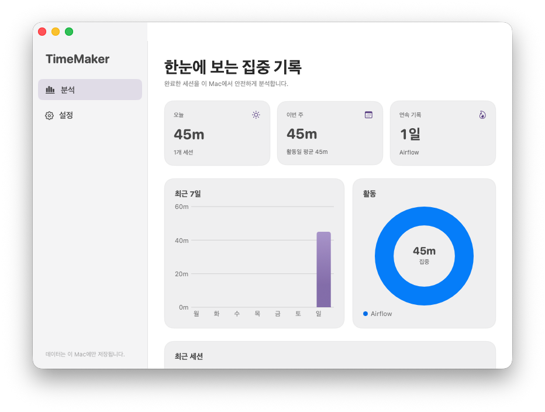

# TimeMaker

[한국어 문서](README.ko.md)

| Main | Analytics |
| --- | --- |
|  |  |

TimeMaker is a native macOS Pomodoro timer that lives in the menu bar. It is built with SwiftUI and AppKit—no Electron, embedded browser, or remote service is used.

## Highlights

- Live `MM:SS` countdown in the menu bar, including durations above one hour such as `90:00`.
- Compact independent timer window with the original single custom close control.
- Activity labels with frequency-ranked autocomplete from previously used labels, flexible separator/case matching, and keyboard selection.
- Scroll-adjustable minutes and seconds with a restored 1–60 timer increment plus a discrete 0.5×–5× sensitivity slider. Minutes apply an additional 2× sensitivity, and an opt-in setting allows adjustment while running or paused.
- Presets for 5, 10, 15, 30, 60, and 90 minutes.
- Pause/resume support and deadline-based timing that remains accurate across sleep and app restarts.
- Today progress dots: each full dot is one hour, with up to eight vertical rows in a left-side overlay grid.
- Local analytics with seven-day focus bars, activity breakdown, streaks, summaries, and recent sessions.
- System/light/dark appearance options.
- Native macOS login-item registration and completion notifications that reopen the timer when clicked, with an optional built-in Glass chime.
- English and Korean interface localizations.

## Requirements

- macOS 14 Sonoma or later
- The packaged `v1.0.4` artifact is built for Apple Silicon (`arm64`)
- Xcode 15.3 or later and Swift 5.10 or later when building from source

## Install

The locally built app is installed at `/Applications/TimeMaker.app`.

For a release download:

1. Download `TimeMaker-1.0.4-macOS-arm64.zip` from the GitHub release.
2. Extract it and move `TimeMaker.app` to `/Applications`.
3. On the first launch, Control-click the app and choose **Open** if Gatekeeper asks for confirmation.
4. Allow notifications when macOS asks. Sound remains optional and uses the built-in Glass chime.

The release is ad-hoc signed because no Apple Developer signing identity is available on the build Mac. It is code-signed and verified locally, but it is not notarized by Apple.

## Use

- The timer window opens when TimeMaker launches; left-click the menu-bar countdown to show or hide it later.
- Right-click the countdown to start, pause, or resume the timer.
- Scroll over the minute or second value while the timer is idle. Each accepted scroll changes the configured increment; choose the discrete 0.5×, 1×, 2×, 3×, 4×, or 5× sensitivity in Settings. Minutes apply an additional 2× sensitivity and stop at the minimum and maximum instead of wrapping. Enable **Adjust active timers by scrolling** to add or remove time from the current running or paused session too.
- Use the reset button in the toolbar to cancel an active timer and return it to its configured duration. Analytics remains available from the More menu.
- Type an activity such as `work`, `Reading`, or `Writing`; matching labels appear below the field. Use Up/Down and Return to select a match, or click one with the mouse.
- Press Play to start. When **Hide window when timer starts** is enabled, the panel closes and the menu-bar countdown remains visible.
- Reopen the panel to pause or resume.

TimeMaker keeps the last activity label after a timer completes. If an empty label is left when the timer window closes, it restores the configured default label. A new installation starts with `work` and `30:00`.

## Settings

| Setting | Default | Range / choices |
| --- | --- | --- |
| Scroll increment | 5 | 1–60 time units per accepted scroll |
| Scroll sensitivity | 1× | 0.5×, 1×, 2×, 3×, 4×, or 5×; minutes apply an additional 2× sensitivity |
| Adjust active timers by scrolling | Off | On / Off; changes apply only to the current running or paused session |
| Open at login | On | On / Off |
| Hide window when timer starts | On | On / Off |
| Include cancelled time in analytics | Off | On / Off |
| Default label | `work` | Any non-empty label |
| Clear past records | — | 1 day, 3 days, 1 week, 1/3/6 months, 1 year, or all; saved labels remain |
| Color mode | System | System / Light / Dark |
| Allow notifications | On | On / Off; clicking a native notification opens the timer |
| Allow notification sound | Off | On / Off; built-in Glass chime |

## Data and privacy

TimeMaker has no account, analytics SDK, telemetry, or network dependency. Timer sessions and label-use counts stay in:

```text
~/Library/Application Support/TimeMaker/history.json
```

Preferences and recoverable active-timer state use the standard macOS preferences domain `com.jaewone.timemaker`.

## Build and test

```bash
swift test
./scripts/build_app.sh
./scripts/install_app.sh
./scripts/package_release.sh
```

Build outputs are written to `dist/` and are excluded from Git. See [Architecture](docs/ARCHITECTURE.md) for the data flow and implementation boundaries.

## License

TimeMaker is licensed under the GNU General Public License v3.0. See [LICENSE](LICENSE) for the full license text.
